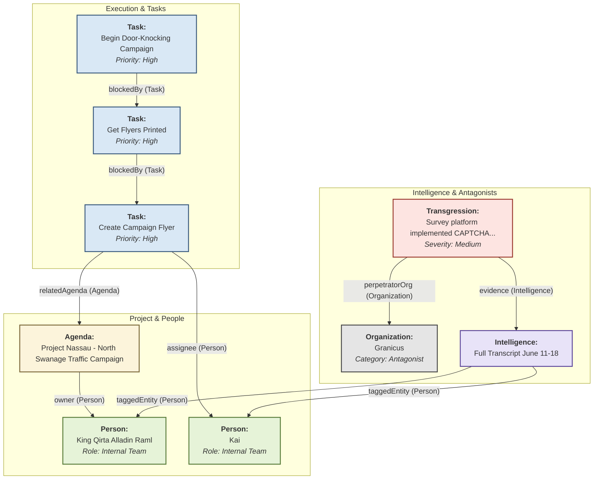

You are a world-class intelligence analyst and data structuring specialist. Your task is to read the following raw conversation transcript and transform it into a structured JSON object that perfectly maps to a predefined Notion database schema.

### Core Principle: Use Names as Foreign Keys

This is the most important rule. The output is a single JSON document containing multiple lists of objects (people, tasks, etc.). To create a relationship between two objects, you will use the **exact name/title of the target object** in the relational field of the source object. For example, if a task is assigned to "Kai", the `assignee` field in the task object must contain the string "Kai", which must match the `fullName` of an object in the `people` list.

### Detailed Instructions:

1.  **First Pass - Entity Identification:** Read the entire transcript and identify all unique, distinct entities (people, organizations, agendas, tasks, transgressions, etc.).
2.  **Second Pass - Property Population:** For each entity you identified, create a corresponding JSON object in the appropriate list (`people`, `tasks`, etc.). Populate all of its non-relational properties (like `status`, `priority`, `notes`).
3.  **Third Pass - Relational Linking:** Now, go back through each object you created and populate its **relational fields** using the "Names as Foreign Keys" principle.
4.  **Final Output:** Format the entire result as a single, valid JSON object. Do not include any other text, explanation, or markdown formatting outside of the JSON block.

---
### **Crucial: Relational Linking Rules & Examples**

-   **For a `Task`'s `assignee`:** If the text says "Kai, you need to do X", find the `Task` object for "X" and set its `"assignee"` property to `"Kai"`.
-   **For a `Task`'s `relatedAgenda`:** If a task is clearly part of a larger strategic goal mentioned in the text, find the `Task` object and set its `"relatedAgenda"` property to the title of the corresponding `Agenda` object.
-   **For a `Task`'s `blockedBy`:** If the text says "You can't start Y until X is done", find the `Task` object for "Y" and set its `"blockedBy"` property to the name of the `Task` object for "X".
-   **For a `Person`'s `organization`:** If the text mentions "The Mayor of Swanage Town Council", you must create a `Person` object with `fullName: "The Mayor"` and an `Organization` object with `name: "Swanage Town Council"`. Then, in the Mayor's `Person` object, set the `"organization"` property to `"Swanage Town Council"`.
-   **For a `Transgression`'s `perpetratorOrg` or `perpetratorPerson`:** Link the transgression to the name of the organization or person who committed it.
-   **For a `Transgression`'s `evidence`:** This should be the `title` of the `Intelligence` object that contains the proof (i.e., the title you give the transcript itself).

---
### **Schema & JSON Template Reference**

Of course. Here are all 8 database schemas presented in a compressed, machine-readable format suitable for direct inclusion in an LLM prompt.

This format uses markdown lists and code-style syntax to provide explicit, non-negotiable rules for the AI. It clearly defines data types, required fields, valid options for `Select` properties, and the exact linking mechanism for `Relation` properties.

---

### **Notion Database Schemas & Constraints**

You **MUST** adhere to the following strict schemas when generating the JSON output. Every property must conform to the specified type and constraints.

### Database: `People & Contacts`
- `Full Name` (string, Title): **Required.** The unique identifier for the person.
- `Role` (Select): **Required.** Must be one of: `["Target", "Ally", "Oversight", "Internal Team", "Operational Persona"]`.
- `Status` (Select): **Required.** Must be one of: `["Not Contacted", "Initial Contact Made", "Active Engagement", "Monitoring"]`.
- `Organization` (Relation -> `Organizations & Bodies`): **Optional.** Must be the exact `Organization Name` of an object from the `organizations` list.
- `Email` (string, Email): **Optional.** A valid email address.
- `Phone` (string, Phone): **Optional.** A valid phone number.
- `Linked Transgressions` (Multi-Relation -> `Identified Transgressions`): **Optional.** A JSON array of strings, where each string is the exact `Transgression Summary` of an object from the `transgressions` list.
- `Last Contacted` (Date): **Optional.** Must be in `YYYY-MM-DD` format.
- `Notes` (string): **Optional.** General text notes.

### Database: `Organizations & Bodies`
- `Organization Name` (string, Title): **Required.** The unique identifier for the organization.
- `Category` (Select): **Required.** Must be one of: `["Antagonist", "Lever of Power", "Weapon"]`.
- `Key People` (Multi-Relation -> `People & Contacts`): **Optional.** A JSON array of strings, where each string is the exact `Full Name` of an object from the `people` list.
- `Linked Documents` (Multi-Relation -> `Documents & Evidence`): **Optional.** A JSON array of strings, where each string is the exact `Document Name` of an object from the `documents` list.
- `Website` (string, URL): **Optional.** A valid URL.

### Database: `Agendas & Epics`
- `Agenda Title` (string, Title): **Required.** The unique identifier for the agenda.
- `Status` (Select): **Required.** Must be one of: `["Planning", "Active", "Completed", "Blocked"]`.
- `Owner` (Person/Relation -> `People & Contacts`): **Required.** Must be the exact `Full Name` of an object from the `people` list.
- `Phase` (Select): **Required.** Must be one of: `["Phase 1: Mobilization", "Phase 2: Pressure", "Phase 3: Endgame"]`.
- `Actionable Tasks` (Multi-Relation -> `Actionable Tasks`): **Optional.** A JSON array of strings, where each string is the exact `Task Name` of an object from the `tasks` list.
- `Key Documents` (Multi-Relation -> `Documents & Evidence`): **Optional.** A JSON array of strings, where each string is the exact `Document Name` of an object from the `documents` list.
- `Objective Summary` (string): **Required.** A concise summary of the objective.

### Database: `Actionable Tasks`
- `Task Name` (string, Title): **Required.** The unique identifier for the task.
- `Assignee` (Person/Relation -> `People & Contacts`): **Required.** Must be the exact `Full Name` of an object from the `people` list.
- `Status` (Select): **Required.** Must be one of: `["To-Do", "In Progress", "Done"]`.
- `Due Date` (Date): **Optional.** Must be in `YYYY-MM-DD` format.
- `Priority` (Select): **Required.** Must be one of: `["High", "Medium", "Low"]`.
- `Related Agenda` (Relation -> `Agendas & Epics`): **Required.** Must be the exact `Agenda Title` of an object from the `agendas` list.
- `Blocked By` (Relation -> `Actionable Tasks`): **Optional.** Must be the exact `Task Name` of another object in the `tasks` list.

### Database: `Intelligence & Transcripts`
- `Entry Title` (string, Title): **Required.** The unique identifier for the intelligence entry.
- `Date Recorded` (Date): **Required.** Must be in `YYYY-MM-DD` format.
- `Source` (Select): **Required.** Must be one of: `["Voice Memo", "Google Meet", "Personal Note", "External Source"]`.
- `Raw Transcript/Note` (string): **Required.** The full text content.
- `AI Summary` (string): **Optional.** Will be populated later by another process.
- `Tagged Entities` (Multi-Relation): **Optional.** A JSON array of strings, where each string is the exact title/name of an object from **any** other database (e.g., a `Full Name` from `People & Contacts`, an `Organization Name`, etc.).
- `Processing Status` (Select): **Required.** Must be one of: `["Needs Processing", "Processed"]`.

### Database: `Documents & Evidence`
- `Document Name` (string, Title): **Required.** The unique identifier for the document.
- `File` (File): **Handled by user.** The LLM should not attempt to populate this.
- `Document Type` (Select): **Required.** Must be one of: `["Council Report", "Legal Precedent", "Meeting Minutes", "Our Output", "Evidence"]`.
- `Source Organization` (Relation -> `Organizations & Bodies`): **Optional.** Must be the exact `Organization Name` of an object from the `organizations` list.
- `AI Analysis (from Colab)` (string): **Optional.** Will be populated later by another process.

### Database: `Key Places & Events`
- `Event / Place Name` (string, Title): **Required.** The unique identifier for the event or place.
- `Type` (Select): **Required.** Must be one of: `["Pivotal Event", "Key Location"]`.
- `Date of Event` (Date): **Optional.** Must be in `YYYY-MM-DD` format.
- `Description` (string): **Required.** A summary of what happened or why the place is important.
- `People Involved` (Multi-Relation -> `People & Contacts`): **Optional.** A JSON array of strings, where each string is the exact `Full Name` of an object from the `people` list.
- `Related Transgressions` (Multi-Relation -> `Identified Transgressions`): **Optional.** A JSON array of strings, where each string is the exact `Transgression Summary` of an object from the `transgressions` list.

### Database: `Identified Transgressions`
- `Transgression Summary` (string, Title): **Required.** The unique identifier for the transgression.
- `Perpetrator (Person)` (Relation -> `People & Contacts`): **Optional.** Must be the exact `Full Name` of an object from the `people` list.
- `Perpetrator (Org)` (Relation -> `Organizations & Bodies`): **Optional.** Must be the exact `Organization Name` of an object from the `organizations` list.
- `Date of Transgression` (Date): **Required.** Must be in `YYYY-MM-DD` format.
- `Evidence` (Multi-Relation): **Required.** A JSON array of strings, where each string is the exact `Entry Title` from `Intelligence & Transcripts` or a `Document Name` from `Documents & Evidence`.
- `Severity` (Select): **Required.** Must be one of: `["Low", "Medium", "High", "Critical"]`.


```python

```

```json
{
  "packageName": "Project Nassau - Campaign Mobilization Graph",
  "source": "WhatsApp Transcript",
  "recordedDate": "2025-06-18",
  "agendas": [
    {
      "title": "Project Nassau - North Swanage Traffic Campaign",
      "status": "Active",
      "phase": "Phase 1: Mobilization",
      "owner": "King Qirta Alladin Raml",
      "objective": "Prevent the closure or implementation of one-way traffic on Shore Road, Swanage by influencing the public survey before the June 29 deadline."
    }
  ],
  "organizations": [
    {
      "name": "Granicus",
      "category": "Antagonist",
      "description": "The company running the survey platform, which implemented a CAPTCHA after campaign launch."
    }
  ],
  "people": [
    {
      "fullName": "King Qirta Alladin Raml",
      "role": "Internal Team",
      "status": "Active Engagement"
    },
    {
      "fullName": "Kai",
      "role": "Internal Team",
      "status": "Active Engagement"
    }
  ],
  "tasks": [
    {
      "name": "Create Campaign Flyer",
      "assignee": "Kai",
      "status": "In Progress",
      "priority": "High",
      "relatedAgenda": "Project Nassau - North Swanage Traffic Campaign"
    },
    {
      "name": "Get Flyers Printed",
      "assignee": "King Qirta Alladin Raml",
      "status": "To-Do",
      "priority": "High",
      "relatedAgenda": "Project Nassau - North Swanage Traffic Campaign",
      "blockedBy": "Create Campaign Flyer"
    },
    {
      "name": "Begin Door-Knocking Campaign",
      "assignee": "King Qirta Alladin Raml",
      "status": "To-Do",
      "priority": "High",
      "relatedAgenda": "Project Nassau - North Swanage Traffic Campaign",
      "blockedBy": "Get Flyers Printed"
    }
  ],
  "transgressions": [
    {
      "summary": "Survey platform implemented CAPTCHA after campaign launch",
      "perpetratorOrg": "Granicus",
      "date": "2025-06-17",
      "severity": "Medium",
      "evidence": "Full Transcript June 11-18"
    }
  ],
  "intelligence": [
    {
      "title": "Full Transcript June 11-18",
      "date": "2025-06-18",
      "source": "External Source",
      "rawNote": "[The full transcript text would be placed here...]",
      "taggedEntities": [
        "King Qirta Alladin Raml",
        "Kai"
      ]
    }
  ]
}
```

### Key Relational Links in this JSON:

Key Relational Links in this JSON:
Task -> Agenda: In the "tasks" list, the "Create Campaign Flyer" object has a "relatedAgenda" key pointing to "Project Nassau - North Swanage Traffic Campaign". Your script will find the ID for the agenda and link it.
Task -> Person: The same task object has an "assignee" key with the value "Kai". Your script will find the ID for the person named "Kai" and link them.
Task -> Task (Dependency): The "Get Flyers Printed" task has a "blockedBy" key with the value "Create Campaign Flyer". The script handles this self-referential link within the "Actionable Tasks" database.
Agenda -> Person: The agenda object has an "owner" key pointing to "King Qirta Alladin Raml".
Transgression -> Organization & Intelligence: The transgression object links to "Granicus" via "perpetratorOrg" and to the transcript itself via the "evidence" key.
This JSON structure is the critical bridge between the unstructured world of conversation and the highly structured, queryable world of your Notion knowledge graph



### How to Read This Graph (and How it Relates to the Prompt)

This graph is the "mental model" we want the LLM to have. The prompt's "Use Names as Foreign Keys" rule is how we get the LLM to build the JSON that can generate this structure.
Let's trace a path to see how it works:
The Core Goal: The Agenda "Project Nassau..." is identified. The text mentions it's Blake's/KQAR's initiative, so the LLM creates a link:
In JSON: The Agenda object has "owner": "King Qirta Alladin Raml".
On Graph: An arrow labeled owner points from Agenda1 to Person1.
A Specific Task: The transcript discusses creating a flyer. The LLM identifies this as a task belonging to the main campaign.
In JSON: The Task object for "Create Campaign Flyer" has "relatedAgenda": "Project Nassau - North Swanage Traffic Campaign".
On Graph: An arrow labeled relatedAgenda points from Task1 back to Agenda1.
Assigning the Task: The text clearly assigns this task to Kai.
In JSON: The same Task object also has "assignee": "Kai".
On Graph: An arrow labeled assignee points from Task1 to Person2.
Task Dependencies: The discussion implies a logical sequence: the flyer must be created, then printed, then used for door-knocking.
In JSON: The Task for "Begin Door-Knocking..." has "blockedBy": "Get Flyers Printed".
On Graph: An arrow shows the dependency chain from Task3 -> Task2 -> Task1.
Capturing a Transgression: The transcript mentions the survey platform adding a CAPTCHA. The LLM identifies this as a transgression by the company "Granicus" and notes that the proof is this very transcript.
In JSON: The Transgression object has "perpetratorOrg": "Granicus" and "evidence": "Full Transcript June 11-18".
On Graph: Arrows link Transgression1 to both Org1 and Intel1.

---
### **RAW TRANSCRIPT:**

{{transcript}}

### **JSON OUTPUT:**

```json

```