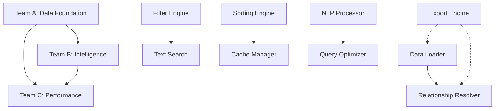

# Query Engine Development Team Specifications

## Executive Summary

This document defines three autonomous development teams for the parallel implementation of Blackcore's modular query engine. Each team has clearly defined responsibilities, interfaces, and deliverables to enable concurrent development without blocking dependencies.

## Team A: Data Foundation Team

### Mission Statement
Build the foundational data access layer that provides efficient, reliable, and type-safe data loading, filtering, and sorting capabilities for the query engine.

### Core Responsibilities

#### 1. Data Loading Module (`loaders/`)
- **Primary Owner**: Team A
- **Deliverables**:
  - `JSONDataLoader`: Load data from JSON cache files
  - `NotionDataLoader`: Direct Notion API integration
  - `DataLoaderInterface`: Common protocol for all loaders
  - Schema validation and type conversion
  - Concurrent multi-database loading
  - Progress callbacks for large datasets

#### 2. Filter Engine Module (`filters/`)
- **Primary Owner**: Team A
- **Deliverables**:
  - Implementation of all 15 query operators
  - Type-aware filtering with automatic conversions
  - Nested field path resolution
  - Filter validation against database schemas
  - Performance-optimized filter algorithms
  - Composite filter support (AND/OR logic)

#### 3. Sorting & Pagination Module (`sorting/`)
- **Primary Owner**: Team A
- **Deliverables**:
  - Multi-field sorting with custom comparators
  - Null value handling strategies
  - Memory-efficient pagination
  - Cursor-based pagination support
  - Sort stability guarantees
  - Performance optimization for large datasets

### Technical Specifications

#### Data Loading Interface
```python
from typing import List, Dict, Any, Optional, Callable
from abc import Protocol

class DataLoader(Protocol):
    """Core data loading interface."""
    
    def load_database(self, database_name: str) -> List[Dict[str, Any]]:
        """Load a database by name."""
        ...
    
    def load_databases_concurrent(
        self, 
        database_names: List[str],
        max_workers: int = 5
    ) -> Dict[str, List[Dict[str, Any]]]:
        """Load multiple databases concurrently."""
        ...
    
    def get_available_databases(self) -> List[str]:
        """Get list of available databases."""
        ...
    
    def get_database_schema(self, database_name: str) -> Dict[str, Any]:
        """Get schema information for a database."""
        ...
    
    def refresh_cache(self, database_name: Optional[str] = None) -> None:
        """Refresh cached data."""
        ...
    
    def set_progress_callback(self, callback: Callable[[str, float], None]) -> None:
        """Set callback for progress updates."""
        ...
```

#### Filter Engine Interface
```python
class FilterEngine(Protocol):
    """Core filtering interface."""
    
    def apply_filters(
        self, 
        data: List[Dict[str, Any]], 
        filters: List[QueryFilter],
        schema: Optional[Dict[str, Any]] = None
    ) -> List[Dict[str, Any]]:
        """Apply filters with optional schema validation."""
        ...
    
    def validate_filters(
        self, 
        filters: List[QueryFilter], 
        schema: Dict[str, Any]
    ) -> List[str]:
        """Validate filters against schema, return errors."""
        ...
    
    def optimize_filter_order(
        self, 
        filters: List[QueryFilter]
    ) -> List[QueryFilter]:
        """Reorder filters for optimal performance."""
        ...
    
    def create_composite_filter(
        self, 
        filters: List[QueryFilter], 
        operator: str = "AND"
    ) -> QueryFilter:
        """Create composite filter from multiple conditions."""
        ...
```

### Dependencies
- **Internal**: Core models and interfaces only
- **External**: None (self-contained)
- **Blocks**: Teams B and C depend on data loading interface

### Deliverable Timeline
- Week 1: Basic data loading and filtering
- Week 2: Advanced filtering and sorting
- Week 3: Performance optimization and testing
- Week 4: Documentation and integration support

### Success Metrics
- All 15 query operators implemented with 100% test coverage
- Data loading performance: <100ms for 10K records
- Filter performance: <50ms for complex queries on 10K records
- Zero memory leaks in pagination implementation

---

## Team B: Intelligence & Search Team

### Mission Statement
Implement advanced search capabilities, relationship resolution, and natural language query processing to enable intuitive and powerful data exploration.

### Core Responsibilities

#### 1. Text Search Module (`search/`)
- **Primary Owner**: Team B
- **Deliverables**:
  - Full-text search with relevance scoring
  - Fuzzy string matching algorithms
  - Field-weighted search (title vs content)
  - Search result highlighting
  - Phonetic search support
  - Multi-language tokenization

#### 2. Relationship Resolution Module (`relationships/`)
- **Primary Owner**: Team B
- **Deliverables**:
  - Multi-level relationship traversal
  - Lazy loading with configurable depth
  - Circular reference detection and handling
  - Relationship caching and optimization
  - Bidirectional relationship support
  - Relationship validation

#### 3. Natural Language Processing (`nlp/`)
- **Primary Owner**: Team B
- **Deliverables**:
  - Natural language to structured query conversion
  - Intent recognition for query types
  - Entity extraction from queries
  - Query suggestion and autocomplete
  - Spell checking and correction
  - Context-aware query interpretation

### Technical Specifications

#### Text Search Interface
```python
class TextSearchEngine(Protocol):
    """Text search interface."""
    
    def search(
        self, 
        query_text: str, 
        data: List[Dict[str, Any]], 
        config: SearchConfig
    ) -> List[SearchResult]:
        """Perform text search with configuration."""
        ...
    
    def build_search_index(
        self, 
        data: List[Dict[str, Any]], 
        fields: List[str]
    ) -> SearchIndex:
        """Build search index for performance."""
        ...
    
    def calculate_relevance_score(
        self, 
        item: Dict[str, Any], 
        query_text: str,
        field_weights: Dict[str, float]
    ) -> float:
        """Calculate weighted relevance score."""
        ...
    
    def highlight_matches(
        self, 
        text: str, 
        query_text: str
    ) -> str:
        """Highlight query matches in text."""
        ...
```

#### Relationship Resolver Interface
```python
class RelationshipResolver(Protocol):
    """Relationship resolution interface."""
    
    def resolve_relationships(
        self, 
        data: List[Dict[str, Any]], 
        includes: List[RelationshipInclude],
        data_loader: DataLoader,
        config: RelationshipConfig
    ) -> List[Dict[str, Any]]:
        """Resolve and embed relationships."""
        ...
    
    def build_relationship_graph(
        self, 
        entities: List[Dict[str, Any]]
    ) -> RelationshipGraph:
        """Build graph structure from entities."""
        ...
    
    def detect_circular_references(
        self, 
        graph: RelationshipGraph
    ) -> List[List[str]]:
        """Detect circular reference chains."""
        ...
```

### Dependencies
- **Internal**: Data Loading interface from Team A
- **External**: Optional AI/ML libraries for NLP
- **Blocks**: Team C can use search capabilities

### Deliverable Timeline
- Week 1: Basic text search implementation
- Week 2: Relationship resolution core
- Week 3: Natural language processing
- Week 4: Advanced features and optimization

### Success Metrics
- Search accuracy: >90% relevant results in top 10
- Relationship resolution: Handle 5+ levels deep
- NLP accuracy: >85% query interpretation success
- Performance: <200ms for complex searches

---

## Team C: Performance & Export Team

### Mission Statement
Optimize query performance through intelligent caching, query optimization, and provide flexible data export capabilities for various use cases.

### Core Responsibilities

#### 1. Caching Layer Module (`cache/`)
- **Primary Owner**: Team C
- **Deliverables**:
  - Memory-based caching with LRU eviction
  - Redis integration for distributed caching
  - File-based persistent cache
  - Cache invalidation strategies
  - Cache warming and preloading
  - Cache statistics and monitoring

#### 2. Query Optimization Module (`optimization/`)
- **Primary Owner**: Team C
- **Deliverables**:
  - Query execution plan generation
  - Cost-based optimization
  - Filter reordering algorithms
  - Index recommendation engine
  - Query pattern analysis
  - Performance profiling tools

#### 3. Export Engine Module (`export/`)
- **Primary Owner**: Team C
- **Deliverables**:
  - JSON export with formatting options
  - CSV export with custom delimiters
  - Excel export with styling
  - PDF report generation
  - Streaming exports for large datasets
  - Template-based export system

### Technical Specifications

#### Cache Manager Interface
```python
class CacheManager(Protocol):
    """Caching interface."""
    
    def get_cached_result(
        self, 
        query_hash: str,
        max_age: Optional[int] = None
    ) -> Optional[CachedResult]:
        """Get cached result with age check."""
        ...
    
    def cache_result(
        self, 
        query_hash: str, 
        result: Any,
        ttl: int = 3600,
        tags: List[str] = []
    ) -> None:
        """Cache result with TTL and tags."""
        ...
    
    def invalidate_by_tags(self, tags: List[str]) -> int:
        """Invalidate cache entries by tags."""
        ...
    
    def get_statistics(self) -> CacheStatistics:
        """Get cache performance statistics."""
        ...
    
    def warm_cache(
        self, 
        queries: List[StructuredQuery],
        executor: QueryExecutor
    ) -> None:
        """Pre-warm cache with common queries."""
        ...
```

#### Query Optimizer Interface
```python
class QueryOptimizer(Protocol):
    """Query optimization interface."""
    
    def optimize_query(
        self, 
        query: StructuredQuery,
        statistics: QueryStatistics
    ) -> OptimizedQuery:
        """Optimize query based on statistics."""
        ...
    
    def generate_execution_plan(
        self, 
        query: StructuredQuery
    ) -> ExecutionPlan:
        """Generate query execution plan."""
        ...
    
    def estimate_cost(
        self, 
        query: StructuredQuery,
        data_statistics: DataStatistics
    ) -> QueryCost:
        """Estimate query execution cost."""
        ...
    
    def suggest_indexes(
        self, 
        query_patterns: List[StructuredQuery]
    ) -> List[IndexSuggestion]:
        """Suggest indexes for query patterns."""
        ...
```

### Dependencies
- **Internal**: Query execution results from Teams A & B
- **External**: Redis (optional), export libraries
- **Blocks**: None (enhances existing functionality)

### Deliverable Timeline
- Week 1: Basic memory caching implementation
- Week 2: Query optimization engine
- Week 3: Export engine with multiple formats
- Week 4: Advanced caching and performance tools

### Success Metrics
- Cache hit rate: >80% for repeated queries
- Query optimization: >30% performance improvement
- Export performance: 100K records in <5 seconds
- Memory efficiency: <100MB overhead for 1M cached items

---

## Integration & Coordination

### Communication Protocol
1. **Daily Standup**: 15-minute sync on Slack
2. **Weekly Integration**: Test cross-team interfaces
3. **Shared Documentation**: Confluence/GitHub wiki
4. **API Contracts**: OpenAPI specifications

### Interface Versioning
- Semantic versioning for all interfaces
- Backward compatibility for minor versions
- Deprecation notices 2 weeks in advance
- Feature flags for experimental features

### Testing Strategy
1. **Unit Tests**: Each team maintains >90% coverage
2. **Integration Tests**: Weekly cross-team testing
3. **Performance Tests**: Shared benchmark suite
4. **Contract Tests**: Interface compliance validation

### Dependency Management


### Risk Mitigation
1. **Interface Stability**: Lock interfaces by end of Week 1
2. **Mock Implementations**: Provide mocks for testing
3. **Feature Flags**: Gradual rollout capabilities
4. **Rollback Plan**: Version-tagged releases

## Agent Specifications

### Agent A: Data Foundation Agent
```yaml
name: DataFoundationAgent
role: Senior Backend Engineer
expertise:
  - Database systems
  - Query optimization
  - Data structures
  - Performance engineering
focus_areas:
  - Efficient data loading
  - Type-safe operations
  - Memory management
  - Algorithm optimization
communication_style: Technical, precise, performance-focused
```

### Agent B: Intelligence Agent
```yaml
name: IntelligenceSearchAgent  
role: AI/ML Engineer
expertise:
  - Natural language processing
  - Information retrieval
  - Graph algorithms
  - Machine learning
focus_areas:
  - Search relevance
  - Relationship mapping
  - Query understanding
  - User experience
communication_style: Innovative, user-centric, research-oriented
```

### Agent C: Performance Agent
```yaml
name: PerformanceExportAgent
role: Infrastructure Engineer
expertise:
  - Distributed systems
  - Caching strategies
  - Performance optimization
  - Data pipelines
focus_areas:
  - System performance
  - Scalability
  - Resource efficiency
  - Export flexibility
communication_style: Metrics-driven, systematic, optimization-focused
```

## Success Criteria

### Overall Project Success
1. **Functionality**: All features implemented and tested
2. **Performance**: Meet all performance benchmarks
3. **Integration**: Seamless component interaction
4. **Documentation**: Complete API and user docs
5. **Quality**: >90% test coverage, <1% defect rate

### Team-Specific KPIs
- **Team A**: Data processing throughput, filter accuracy
- **Team B**: Search relevance, NLP accuracy
- **Team C**: Cache efficiency, export performance

This specification enables three autonomous agents to work in parallel while maintaining clear boundaries and integration points.